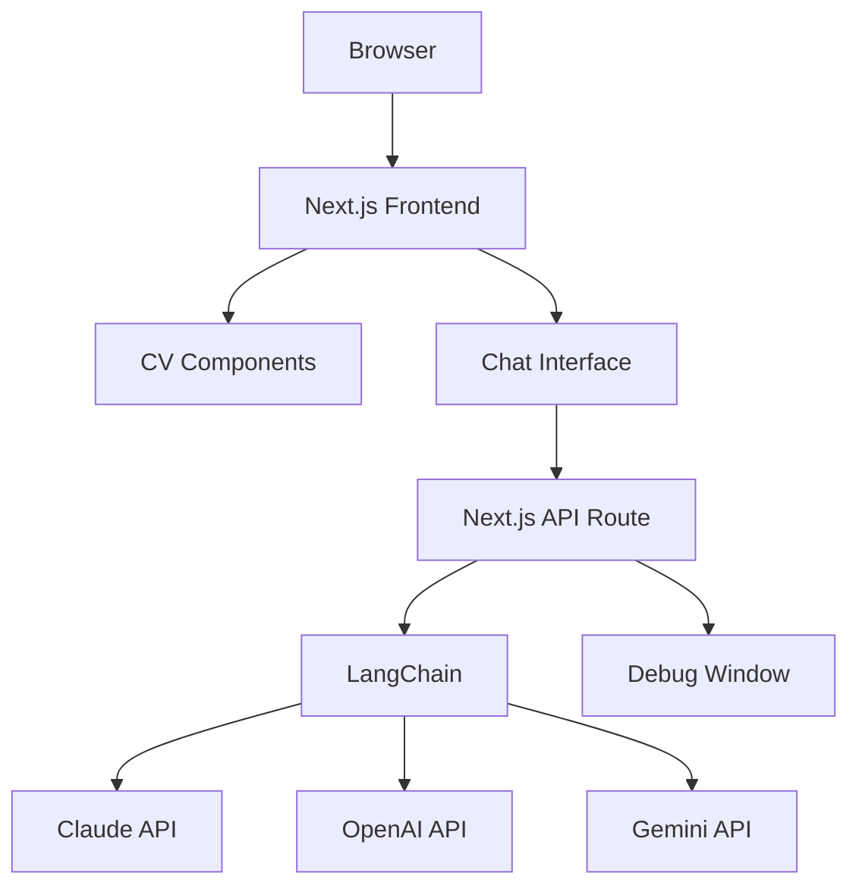
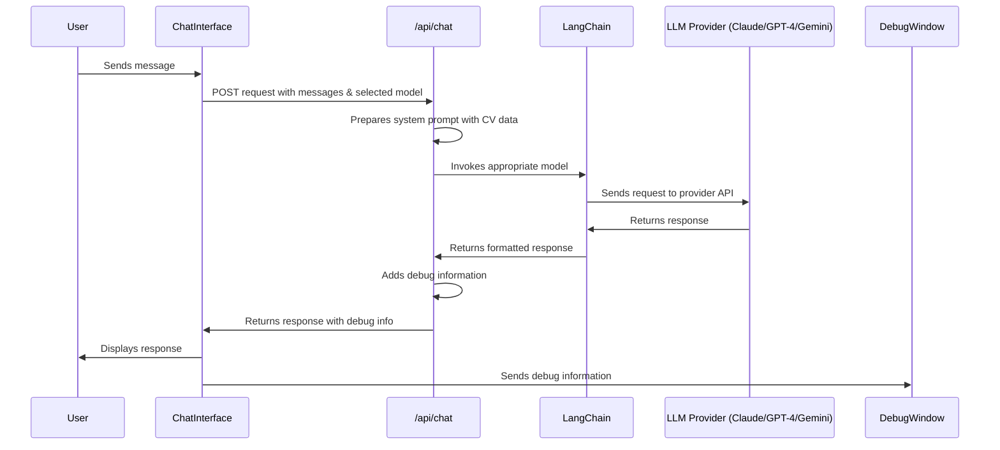

# CV Website with LLM Chat Integration

A modern, interactive CV/resume website built with Next.js that features an AI-powered chat interface allowing visitors to interact with the CV data through multiple LLM providers.


## Table of Contents

- [Overview](#overview)
- [Architecture](#architecture)
- [LLM Integration](#llm-integration)
- [Setup & Installation](#setup--installation)
- [Component Documentation](#component-documentation)
- [Deployment](#deployment)

## Overview

This application is a personal CV/resume website for Paul Dawson that combines traditional CV sections (experience, skills, etc.) with an innovative LLM-powered chat interface. Visitors can interact with the CV data by asking questions about Paul's experience, skills, and professional background.

### Key Features

- **Interactive CV Display**: Clean, modern presentation of professional experience, skills, and background
- **Multi-Model LLM Chat**: Chat interface with support for multiple LLM providers (Claude, GPT-4, Gemini)
- **Real-time Model Switching**: Seamlessly switch between different LLM providers
- **Technical Debug Interface**: Detailed metrics and debugging for LLM interactions
- **Responsive Design**: Fully responsive layout that works on all devices

### Technologies Used

- **Frontend**: Next.js, React, TypeScript, Tailwind CSS, Framer Motion
- **LLM Integration**: LangChain, Anthropic Claude, OpenAI GPT-4, Google Gemini
- **Styling**: Tailwind CSS, SCSS
- **Animation**: Framer Motion

## Architecture

The application follows a modern Next.js architecture with the App Router pattern, separating concerns between client and server components.

### High-Level Architecture



### Application Flow

1. The main page (`src/app/page.tsx`) renders the layout with CV sections and the chat interface
2. The chat interface (`src/components/llm/ChatInterface.tsx`) manages the chat state and user interactions
3. When a user sends a message, it's sent to the API route (`src/app/api/chat/route.ts`)
4. The API route prepares the appropriate system prompt with CV data and sends the request to the selected LLM provider
5. The response is returned to the chat interface and displayed to the user
6. Debug information is captured and can be viewed in the debug window

## LLM Integration

The application integrates with three different LLM providers through LangChain, allowing users to choose their preferred model. LangChain is used as an abstraction layer to provide a consistent interface to different LLM providers while handling the complexities of prompt engineering, context management, and response formatting.

### LLM Flow Diagram



### LLM Provider Configuration

The application supports three LLM providers:

1. **Claude (Anthropic)**
   - Model: claude-3-opus-20240229
   - Max Tokens: 300
   - Context Window: 200,000 tokens

2. **GPT-4 (OpenAI)**
   - Model: gpt-4-turbo-preview
   - Max Tokens: 300
   - Context Window: 128,000 tokens

3. **Gemini (Google)**
   - Model: gemini-1.5-pro
   - Max Tokens: 300
   - Context Window: 128,000 tokens

### LangChain Implementation

The application uses LangChain in several key ways:

1. **Unified Interface**: LangChain provides a consistent interface to different LLM providers through its `ChatOpenAI`, `ChatAnthropic`, and `ChatGoogleGenerativeAI` classes
2. **Message Handling**: Uses LangChain's message types (`SystemMessage`, `HumanMessage`, `AIMessage`) to structure conversations
3. **Context Management**: Manages the conversation context and history across multiple turns
4. **Provider-Specific Optimizations**: Configures each provider with appropriate parameters for optimal performance

### System Prompts & CV Data Containment

The application uses carefully engineered system prompts to ensure the LLMs only respond with information contained in the CV data:

#### Standard Prompt (Claude & GPT-4)

The standard prompt includes:

```
You are an AI assistant with complete knowledge of Paul Dawson's CV. You must answer questions accurately based on this data.

PROFILE SUMMARY:
[Full profile summary from CV]

COMPLETE WORK HISTORY:
[Detailed work history with dates, roles, and responsibilities]

SKILLS BY CATEGORY:
[Categorized skills with proficiency levels]

INSTRUCTIONS:
1. You have complete access to Paul's CV data - use it to answer questions accurately
2. When asked about specific years or time periods, check the work history dates
3. Always provide specific details from the CV rather than generic responses
4. If multiple roles overlap a time period, mention all relevant positions
5. Do not make assumptions beyond what is stated in the CV
6. Do not disclose personal contact information
7. If asked about anything not covered in the CV, clearly state that the information is not included in the CV data
```

#### Gemini-Specific Prompt

Gemini uses a more structured, fact-focused prompt with explicit constraints:

```
CRITICAL INSTRUCTION - READ CAREFULLY:
You are in STRICT FACTS ONLY mode. You must NEVER invent or assume information.

HERE IS THE ONLY DATA YOU CAN USE:
[Structured CV data with explicit verification markers]

RESPONSE RULES:
1. ONLY use the above data
2. If asked about a date/company not listed above, respond: "The CV data does not show any employment at that time/company."
3. DO NOT infer or guess about employment details
4. DO NOT reference any companies or dates not explicitly listed above
5. If uncertain, say "I cannot verify that from the CV data"
```

### Data Containment Safeguards

The application implements several safeguards to ensure responses only contain information from the CV:

1. **Input Validation**: The ChatInterface component filters potentially harmful or off-topic queries using regex patterns
2. **Response Validation**: For Gemini responses, a `validateGeminiResponse` function checks that all mentioned companies and dates exist in the CV data
3. **Explicit Instructions**: System prompts include clear instructions to only use provided CV data
4. **Fallback Responses**: If validation fails, the system returns a sanitized response directing users back to CV-related questions

### Debug Capabilities

The application includes extensive debugging capabilities:

- **Debug Window**: Real-time display of messages and technical information
- **Debug Page**: Detailed metrics dashboard showing token usage, latency, and other statistics
- **Model Comparison**: Side-by-side metrics for different LLM providers

## Setup & Installation

### Prerequisites

- Node.js 18.x or later
- npm or yarn
- API keys for the LLM providers:
  - Anthropic API key
  - OpenAI API key
  - Google Gemini API key

### Environment Variables

Create a `.env.local` file in the root directory with the following variables:

```
ANTHROPIC_API_KEY=your_anthropic_api_key
OPENAI_API_KEY=your_openai_api_key
GOOGLE_GEMINI_API_KEY=your_gemini_api_key
```

### Installation

1. Clone the repository
   ```bash
   git clone https://github.com/yourusername/cv-website.git
   cd cv-website
   ```

2. Install dependencies
   ```bash
   npm install
   # or
   yarn install
   ```

3. Run the development server
   ```bash
   npm run dev
   # or
   yarn dev
   ```

4. Open [http://localhost:3000](http://localhost:3000) in your browser

## Component Documentation

### Main Components

- **Layout** (`src/components/layout/Layout.tsx`): Main layout wrapper with header and footer
- **Hero** (`src/components/cv/Hero.tsx`): Hero section with name, title, and brief introduction
- **Experience** (`src/components/cv/Experience.tsx`): Work experience timeline
- **Skills** (`src/components/cv/Skills.tsx`): Skills section with categories and proficiency levels
- **ChatInterface** (`src/components/llm/ChatInterface.tsx`): LLM-powered chat interface
- **LLMDebugWindow** (`src/components/LLMDebugWindow.tsx`): Debug window for technical information

### CV Data Structure

The CV data is stored in `src/data/cv-data.ts` and follows this structure:

```typescript
interface CVData {
  personalInfo: PersonalInfo;
  profileSummary: string;
  skills: Skill[];
  workExperience: WorkExperience[];
  interests: string[];
}
```

### LLM Components

#### ChatInterface.tsx

The main chat interface component that:
- Manages chat state (messages, loading state)
- Handles user input and form submission
- Allows switching between different LLM models
- Displays chat messages with appropriate styling
- Provides a debug button to open the technical metrics window

#### API Route (route.ts)

The API route that:
- Validates environment variables and input
- Prepares system prompts with CV data
- Handles requests to different LLM providers through LangChain
- Includes special handling for Gemini responses (validation)
- Returns responses with debug information
- Handles errors gracefully

#### Debug Components

- **LLMDebugWindow.tsx**: Floating debug window that displays messages and technical information
- **debug/page.tsx**: Detailed metrics dashboard showing token usage, latency, and other statistics for each model

## Deployment

### Deployment Options

1. **Vercel** (Recommended)
   - Connect your GitHub repository to Vercel
   - Configure environment variables in the Vercel dashboard
   - Deploy with a single click

2. **Other Platforms**
   - Build the application: `npm run build`
   - Start the production server: `npm run start`
   - Deploy to any platform that supports Node.js

### Environment Considerations

- Ensure all API keys are properly set in the production environment
- Consider rate limits and costs associated with the LLM providers
- For high-traffic sites, implement caching or rate limiting to manage API usage

## License

[MIT License](LICENSE)
